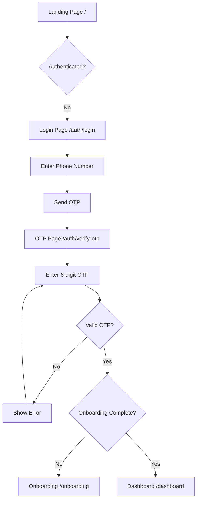

# FinMatter - Technical Documentation

**Version:** 1.0.0  
**Last Updated:** January 8, 2025  
**Author:** FinMatter Engineering Team

---

## Table of Contents

1. [System Overview](#1-system-overview)
2. [Architecture](#2-architecture)
3. [Technology Stack](#3-technology-stack)
4. [Project Structure](#4-project-structure)
5. [API Documentation](#5-api-documentation)
6. [Data Models](#6-data-models)
7. [Authentication & Security](#7-authentication--security)
8. [User Flows](#8-user-flows)
9. [Setup & Installation](#9-setup--installation)
10. [Development Guidelines](#10-development-guidelines)
11. [Deployment](#11-deployment)
12. [Testing](#12-testing)
13. [Monitoring & Logging](#13-monitoring--logging)
14. [Troubleshooting](#14-troubleshooting)
15. [Future Roadmap](#15-future-roadmap)

---

## 1. System Overview

### 1.1 Product Description

FinMatter is a comprehensive credit card management platform that helps users:

- Track and manage multiple credit cards in one place
- Get smart recommendations for maximizing rewards
- Analyze spending patterns and optimize card usage
- Monitor credit utilization and financial health
- Parse credit card statements automatically

### 1.2 Key Features

#### ✅ Implemented

- **Phone-based OTP Authentication** (Supabase + Twilio)
- **Multi-step Onboarding** (5 steps: Welcome → Name → Permissions → Tutorial → First Card)
- **Credit Card Portfolio Management** (Add, Edit, Delete, View)
- **Card Benefits Management** (Category-based rewards tracking)
- **Visual Card Representations** (Gradient cards with brand colors)
- **Portfolio Analytics** (Total limit, utilization, available credit)
- **Card Metadata Integration** (21+ banks, 860+ lines of card data)
- **Search & Filtering** (By bank, name, category, utilization)
- **PWA Support** (Installable, offline-capable)
- **Responsive Design** (Mobile-first, tablet, desktop)

#### 🚧 Planned

- Transaction tracking and categorization
- Statement upload and AI-powered parsing
- Spending analytics and insights
- Card optimizer (best card recommendations)
- Reward calculator
- AI chat assistant
- Push notifications
- Biometric authentication

### 1.3 Target Users

- **Primary:** Indian credit card holders (age 25-45)
- **Use Case:** Managing multiple credit cards efficiently
- **Pain Point:** Difficulty tracking rewards, benefits, and optimal card usage

---

## 2. Architecture

### 2.1 System Architecture

```
┌────────────────────────────────────────────────────────────┐
│                     CLIENT LAYER                           │
│          ┌──────────────┐      ┌──────────────┐            |
│          │   Web PWA    │      │   Future Web │            |
│          │  (Next.js)   │      │     App      │            |
│          └──────┬───────┘      └──────┬───────┘            |
└─────────────────┼─────────────────────┼────────────────────┘
                  │                     │
                  └─────────────────────┴
                             │
          ┌──────────────────▼──────────────────┐
          │          API LAYER                  │
          │      (Next.js API Routes)           │
          │   ┌────────────────────────────┐    │
          │   │  /api/auth/*               │    │
          │   │  /api/cards/*              │    │
          │   │  /api/users/*              │    │
          │   │  /api/transactions/* (TBD) │    │
          │   └────────────────────────────┘    │
          └───────────────┬─────────────────────┘
                         │
          ┌──────────────▼─────────────────────┐
          │      BUSINESS LOGIC LAYER          │
          │    (Shared Packages)               │
          │   ┌────────────────────────────┐   │
          │   │  @finmatter/cc-engine      │   │
          │   │  - Card metadata (860+)    │   │
          │   │  - Optimizer               │   │
          │   │  - Parser                  │   │
          │   │  - Categorizer             │   │
          │   └────────────────────────────┘   │
          │   ┌────────────────────────────┐   │
          │   │  @finmatter/shared         │   │
          │   │  - Utilities               │   │
          │   │  - Validators              │   │
          │   │  - Formatters              │   │
          │   │  - Error handling          │   │
          │   └────────────────────────────┘   │
          │   ┌────────────────────────────┐   │
          │   │  @finmatter/types          │   │
          │   │  - TypeScript definitions  │   │
          │   └────────────────────────────┘   │
          └──────────────┬─────────────────────┘
                         │
          ┌──────────────▼─────────────────────┐
          │       DATA & SERVICES LAYER        │
          │   ┌────────────────────────────┐   │
          │   │  Supabase                  │   │
          │   │  - PostgreSQL Database     │   │
          │   │  - Authentication          │   │
          │   │  - Row Level Security      │   │
          │   └────────────────────────────┘   │
          │   ┌────────────────────────────┐   │
          │   │  Twilio                    │   │
          │   │  - SMS OTP Delivery        │   │
          │   └────────────────────────────┘   │
          │   ┌────────────────────────────┐   │
          │   │  OpenAI (Planned)          │   │
          │   │  - AI Assistant            │   │
          │   │  - Statement Parsing       │   │
          │   └────────────────────────────┘   │
          └────────────────────────────────────┘
```

### 2.2 Data Flow

#### Authentication Flow

```
User → Web PWA → POST /api/auth/send-otp → Supabase Auth → Twilio SMS
                                                    ↓
User receives OTP → POST /api/auth/verify-otp → Verify → Create/Update User → Return JWT
                                                              ↓
                                                      Store in localStorage
```

#### Card Management Flow

```
User → Add Card → POST /api/cards → Validate → Check Auth → Insert into DB
                                                                  ↓
                                                          RLS Policy Check
                                                                  ↓
                                                          Return Card + Benefits
```

### 2.3 Monorepo Structure

```
finmatter/
├── apps/
│   ├── api/                # Next.js API Server
│   ├── web-pwa/            # Progressive Web App
│   └── web/                # Web Admin App
├── packages/
│   ├── cc-engine/          # Credit Card Engine
│   ├── shared/             # Shared Utilities
│   ├── types/              # TypeScript Types
│   └── ui/                 # Shared UI Components
├── supabase/
│   ├── migrations/         # Database Migrations
│   └── config.toml         # Supabase Config
├── turbo.json              # Turborepo Config
├── pnpm-workspace.yaml     # pnpm Workspace
└── package.json            # Root Package
```

---

## 3. Technology Stack

### 3.1 Frontend (Web PWA)

| Technology          | Version | Purpose                      |
| ------------------- | ------- | ---------------------------- |
| **Next.js**         | 14.2.0  | React framework with SSR/SSG |
| **React**           | 18.2.0  | UI library                   |
| **TypeScript**      | 5.3.0   | Type safety                  |
| **Tailwind CSS**    | 3.4.0   | Styling                      |
| **Zustand**         | 4.5.2   | State management             |
| **React Hook Form** | 7.48.0  | Form handling                |
| **Zod**             | 3.22.0  | Schema validation            |
| **Axios**           | 1.6.5   | HTTP client                  |
| **Lucide React**    | 0.400.0 | Icons                        |
| **Framer Motion**   | 11.18.2 | Animations                   |
| **SWR**             | 2.2.5   | Data fetching                |

### 3.2 Backend (API)

| Technology    | Version | Purpose               |
| ------------- | ------- | --------------------- |
| **Next.js**   | 14.1.0  | API routes framework  |
| **Supabase**  | 2.58.0  | Database + Auth       |
| **Zod**       | 3.25.76 | Request validation    |
| **JWT**       | 9.0.2   | Token generation      |
| **OpenAI**    | 4.24.1  | AI features (planned) |
| **pdf-parse** | 1.1.1   | Statement parsing     |
| **multer**    | 1.4.5   | File uploads          |

### 3.3 Custom Hooks (Web PWA)

| Hook              | Purpose                          |
| ----------------- | -------------------------------- |
| **useAuth**       | Authentication state and actions |
| **useCards**      | Card CRUD operations and state   |
| **useOnboarding** | Onboarding flow management       |
| **useCardSearch** | Card search and filtering logic  |

### 3.4 Shared Packages

| Package                  | Purpose                           |
| ------------------------ | --------------------------------- |
| **@finmatter/types**     | TypeScript type definitions       |
| **@finmatter/shared**    | Utilities, validators, formatters |
| **@finmatter/cc-engine** | Card metadata, optimizer, parser  |
| **@finmatter/ui**        | Shared UI components (planned)    |

### 3.5 Infrastructure

| Service       | Purpose                            |
| ------------- | ---------------------------------- |
| **Supabase**  | PostgreSQL database, auth, storage |
| **Twilio**    | SMS OTP delivery                   |
| **Vercel**    | Deployment (recommended)           |
| **pnpm**      | Package manager                    |
| **Turborepo** | Monorepo build system              |

---

## 4. Project Structure

### 4.1 Web PWA Structure

```
apps/web-pwa/
├── src/
│   ├── app/                          # Next.js App Router
│   │   ├── auth/
│   │   │   ├── login/page.tsx        # Phone input
│   │   │   └── verify-otp/page.tsx   # OTP verification
│   │   ├── onboarding/page.tsx       # 5-step onboarding
│   │   ├── dashboard/page.tsx        # Main dashboard
│   │   ├── cards/
│   │   │   ├── page.tsx              # Cards list
│   │   │   ├── add/page.tsx          # Add card wizard
│   │   │   └── [id]/
│   │   │       ├── page.tsx          # Card details
│   │   │       ├── edit/page.tsx     # Edit card
│   │   │       └── benefits/
│   │   │           ├── add/page.tsx
│   │   │           └── [benefitId]/edit/page.tsx
│   │   ├── layout.tsx                # Root layout
│   │   ├── page.tsx                  # Home (router)
│   │   └── globals.css               # Global styles
│   ├── components/
│   │   ├── auth/                     # Auth components
│   │   ├── cards/                    # Card components
│   │   │   ├── CardVisual.tsx        # Visual card representation
│   │   │   ├── CardStats.tsx         # Card statistics
│   │   │   ├── CardGrid.tsx          # Card grid layout
│   │   │   ├── PortfolioStats.tsx    # Portfolio overview
│   │   │   └── FilterModal.tsx       # Filter dialog
│   │   ├── forms/
│   │   │   └── PhoneInput.tsx        # Phone input with validation
│   │   ├── layout/
│   │   │   └── DashboardLayout.tsx   # Dashboard layout
│   │   ├── onboarding/               # Onboarding steps
│   │   │   ├── WelcomeStep.tsx
│   │   │   ├── NameStep.tsx
│   │   │   ├── PermissionsStep.tsx
│   │   │   ├── TutorialStep.tsx
│   │   │   └── AddFirstCardStep.tsx
│   │   ├── providers/
│   │   │   └── Providers.tsx         # Context providers
│   │   └── ui/                       # UI primitives
│   │       ├── Button.tsx
│   │       ├── Modal.tsx
│   │       ├── LoadingSpinner.tsx
│   │       └── EmptyState.tsx
│   ├── hooks/                        # Custom hooks
│   ├── lib/
│   │   ├── apiClient.ts              # Axios client
│   │   ├── supabase.ts               # Supabase client
│   │   ├── errorHandler.ts           # Error handling
│   │   └── utils.ts                  # Utilities
│   ├── services/
│   │   ├── authService.ts            # Auth API calls
│   │   └── cardService.ts            # Card API calls
│   ├── stores/
│   │   ├── authStore.ts              # Auth state (Zustand)
│   │   └── cardStore.ts              # Card state (Zustand)
│   └── types/                        # Local types
├── public/
│   ├── manifest.json                 # PWA manifest
│   └── *.svg                         # Static assets
├── tailwind.config.js                # Tailwind configuration
├── next.config.ts                    # Next.js configuration
└── package.json                      # Dependencies
```

### 4.2 API Structure

```
apps/api/
├── src/
│   ├── app/
│   │   ├── api/
│   │   │   ├── auth/
│   │   │   │   ├── send-otp/route.ts
│   │   │   │   └── verify-otp/route.ts
│   │   │   ├── cards/
│   │   │   │   ├── route.ts              # GET, POST /api/cards
│   │   │   │   └── [id]/
│   │   │   │       ├── route.ts          # GET, PUT, DELETE /api/cards/:id
│   │   │   │       └── benefits/
│   │   │   │           ├── route.ts      # GET, POST benefits
│   │   │   │           └── [benefitId]/route.ts
│   │   │   ├── users/
│   │   │   │   ├── onboarding/route.ts   # PUT onboarding
│   │   │   │   └── profile/route.ts      # PUT profile
│   │   │   └── health/route.ts           # Health check
│   │   ├── layout.tsx
│   │   └── favicon.ico
│   ├── lib/
│   │   ├── cors.ts                       # CORS helpers
│   │   ├── errorHandler.ts               # Error handling
│   │   └── supabase/
│   │       └── client.ts                 # Supabase admin client
│   └── middleware.ts                     # CORS middleware
└── package.json
```

### 4.3 Package Structure

```
packages/
├── cc-engine/
│   ├── src/
│   │   ├── data/
│   │   │   └── cards/
│   │   │       └── index.ts          # 860+ lines of card metadata
│   │   ├── services/
│   │   │   └── cardSearch.ts         # Card search service
│   │   ├── optimizer/index.ts        # Card optimizer
│   │   ├── parsers/index.ts          # Statement parser
│   │   ├── categorizer/index.ts      # Transaction categorizer
│   │   ├── calculators/index.ts      # Reward calculators
│   │   └── index.ts                  # Main exports
│   └── package.json
├── shared/
│   ├── src/
│   │   ├── errors.ts                 # Error classes
│   │   ├── validators.ts             # Validation functions
│   │   ├── formatters.ts             # Formatting utilities
│   │   ├── currency.ts               # Currency utilities
│   │   ├── date.ts                   # Date utilities
│   │   ├── constants.ts              # Constants
│   │   ├── utils.ts                  # General utilities
│   │   ├── api.ts                    # API helpers
│   │   └── index.ts                  # Main exports
│   └── package.json
└── types/
    ├── src/
    │   ├── api.ts                    # API types
    │   ├── auth.ts                   # Auth types
    │   ├── card.ts                   # Card types
    │   ├── user.ts                   # User types
    │   ├── transaction.ts            # Transaction types
    │   ├── common.ts                 # Common types
    │   ├── database.ts               # Database types
    │   └── index.ts                  # Main exports
    └── package.json
```

---

## 5. API Documentation

### 5.1 Authentication APIs

#### POST `/api/auth/send-otp`

Send OTP to user's phone number.

**Request:**

```json
{
  "phoneNumber": "+918950494219"
}
```

**Response (Success):**

```json
{
  "success": true,
  "data": {
    "success": true,
    "message": "OTP sent successfully",
    "expiresIn": 300
  }
}
```

**Response (Rate Limited):**

```json
{
  "success": false,
  "error": {
    "code": "RATE_LIMIT_EXCEEDED",
    "message": "Too many OTP requests. Please try again in 300 seconds.",
    "timestamp": "2025-01-08T10:30:00Z"
  },
  "rateLimit": {
    "attempts": 3,
    "remaining": 0,
    "resetTime": "2025-01-08T10:35:00Z",
    "retryAfter": 300
  }
}
```

**Validation:**

- Phone must include +91 country code
- Format: `+91XXXXXXXXXX` (10 digits after +91)
- Rate limit: 3 attempts per 10 minutes per phone number

---

#### POST `/api/auth/verify-otp`

Verify OTP and create user session.

**Request:**

```json
{
  "phoneNumber": "+918950494219",
  "otp": "123456"
}
```

**Response (Success):**

```json
{
  "success": true,
  "data": {
    "user": {
      "id": "uuid",
      "phoneNumber": "+918950494219",
      "isVerified": true,
      "biometricEnabled": false,
      "createdAt": "2025-01-08T10:30:00Z",
      "lastLogin": "2025-01-08T10:30:00Z"
    },
    "session": {
      "token": "eyJhbGciOiJIUzI1NiIsInR5cCI6IkpXVCJ9...",
      "refreshToken": "refresh_token_here",
      "expiresAt": "2025-01-09T10:30:00Z"
    }
  }
}
```

**Response (Invalid OTP):**

```json
{
  "success": false,
  "error": {
    "code": "INVALID_OTP",
    "message": "Invalid OTP. Please check and try again.",
    "timestamp": "2025-01-08T10:30:00Z"
  }
}
```

---

### 5.2 User APIs

#### PUT `/api/users/onboarding`

Complete user onboarding.

**Headers:**

```
Authorization: Bearer <token>
```

**Request:**

```json
{
  "firstName": "Vikrant",
  "lastName": "Negi",
  "notificationsEnabled": true
}
```

**Response:**

```json
{
  "success": true,
  "data": {
    "user": {
      "id": "uuid",
      "phoneNumber": "+918950494219",
      "firstName": "Vikrant",
      "lastName": "Negi",
      "onboardingCompleted": true,
      "isVerified": true,
      "biometricEnabled": false,
      "createdAt": "2025-01-08T10:30:00Z",
      "updatedAt": "2025-01-08T10:35:00Z"
    }
  }
}
```

---

### 5.3 Card APIs

#### GET `/api/cards`

Get user's card portfolio.

**Headers:**

```
Authorization: Bearer <token>
```

**Query Parameters:**

- `status`: Filter by status (active, inactive, blocked, expired)
- `cardType`: Filter by type (credit, debit, prepaid)
- `bankName`: Filter by bank name
- `limit`: Number of cards to return (default: 20, max: 100)
- `offset`: Offset for pagination (default: 0)

**Example:**

```
GET /api/cards?status=active&limit=10&offset=0
```

**Response:**

```json
{
  "success": true,
  "data": {
    "cards": [
      {
        "id": "uuid",
        "user_id": "uuid",
        "bank_name": "HDFC Bank",
        "card_name": "HDFC Millennia Credit Card",
        "last_four_digits": "1234",
        "card_type": "credit",
        "network": "visa",
        "reward_type": "cashback",
        "annual_fee": 1000,
        "currency": "INR",
        "status": "active",
        "credit_limit": 100000,
        "available_credit": 75000,
        "created_at": "2025-01-08T10:30:00Z",
        "updated_at": "2025-01-08T10:30:00Z",
        "card_benefits": [
          {
            "id": "uuid",
            "card_id": "uuid",
            "category": "shopping",
            "reward_rate": 5.0,
            "reward_cap": 1000,
            "conditions": {},
            "is_active": true
          }
        ]
      }
    ],
    "pagination": {
      "limit": 10,
      "offset": 0,
      "total": 5,
      "hasMore": false
    }
  }
}
```

---

#### POST `/api/cards`

Add a new card.

**Headers:**

```
Authorization: Bearer <token>
```

**Request:**

```json
{
  "bankName": "HDFC Bank",
  "cardName": "HDFC Millennia Credit Card",
  "lastFourDigits": "1234",
  "cardType": "credit",
  "network": "visa",
  "rewardType": "cashback",
  "annualFee": 1000,
  "currency": "INR",
  "creditLimit": 100000,
  "availableCredit": 75000,
  "issueDate": "2024-01-01",
  "expiryDate": "2029-01-31"
}
```

**Response:**

```json
{
  "success": true,
  "data": {
    "card": {
      "id": "uuid",
      "user_id": "uuid",
      "bank_name": "HDFC Bank",
      "card_name": "HDFC Millennia Credit Card",
      "last_four_digits": "1234",
      "card_type": "credit",
      "network": "visa",
      "reward_type": "cashback",
      "annual_fee": 1000,
      "currency": "INR",
      "status": "active",
      "credit_limit": 100000,
      "available_credit": 75000,
      "created_at": "2025-01-08T10:30:00Z",
      "updated_at": "2025-01-08T10:30:00Z",
      "card_benefits": []
    }
  }
}
```

---

#### GET `/api/cards/:id`

Get specific card details.

**Headers:**

```
Authorization: Bearer <token>
```

**Response:**

```json
{
  "success": true,
  "data": {
    "card": {
      "id": "uuid",
      "user_id": "uuid",
      "bank_name": "HDFC Bank",
      "card_name": "HDFC Millennia Credit Card",
      "last_four_digits": "1234",
      "card_type": "credit",
      "network": "visa",
      "reward_type": "cashback",
      "annual_fee": 1000,
      "currency": "INR",
      "status": "active",
      "credit_limit": 100000,
      "available_credit": 75000,
      "created_at": "2025-01-08T10:30:00Z",
      "updated_at": "2025-01-08T10:30:00Z",
      "card_benefits": [
        {
          "id": "uuid",
          "card_id": "uuid",
          "category": "shopping",
          "reward_rate": 5.0,
          "reward_cap": 1000,
          "reward_type": "cashback",
          "conditions": {
            "minTransaction": 1000,
            "online": true
          },
          "is_active": true,
          "created_at": "2025-01-08T10:30:00Z",
          "updated_at": "2025-01-08T10:30:00Z"
        }
      ]
    }
  }
}
```

---

#### PUT `/api/cards/:id`

Update card details.

**Headers:**

```
Authorization: Bearer <token>
```

**Request (Partial Update):**

```json
{
  "availableCredit": 80000,
  "status": "active"
}
```

**Response:**

```json
{
  "success": true,
  "data": {
    "card": {
      // Updated card object
    }
  }
}
```

---

#### DELETE `/api/cards/:id`

Soft delete card (sets status to inactive).

**Headers:**

```
Authorization: Bearer <token>
```

**Response:**

```json
{
  "success": true,
  "data": {
    "message": "Card deleted successfully",
    "card": {
      "id": "uuid",
      "card_name": "HDFC Millennia Credit Card",
      "status": "inactive"
    }
  }
}
```

---

### 5.4 Benefits APIs

#### GET `/api/cards/:id/benefits`

Get card's reward benefits.

**Headers:**

```
Authorization: Bearer <token>
```

**Response:**

```json
{
  "success": true,
  "data": {
    "benefits": [
      {
        "id": "uuid",
        "card_id": "uuid",
        "category": "shopping",
        "reward_rate": 5.0,
        "reward_type": "cashback",
        "reward_cap": 1000,
        "conditions": {
          "minTransaction": 1000,
          "online": true
        },
        "is_active": true,
        "created_at": "2025-01-08T10:30:00Z",
        "updated_at": "2025-01-08T10:30:00Z"
      },
      {
        "id": "uuid",
        "card_id": "uuid",
        "category": "dining",
        "reward_rate": 5.0,
        "reward_type": "cashback",
        "reward_cap": 1000,
        "conditions": {},
        "is_active": true,
        "created_at": "2025-01-08T10:30:00Z",
        "updated_at": "2025-01-08T10:30:00Z"
      }
    ]
  }
}
```

---

#### POST `/api/cards/:id/benefits`

Add new benefit to card.

**Headers:**

```
Authorization: Bearer <token>
```

**Request:**

```json
{
  "category": "fuel",
  "rewardRate": 1.0,
  "rewardType": "cashback",
  "rewardCap": 500,
  "conditions": {
    "fuelStations": ["BPCL", "HPCL", "Indian Oil"]
  },
  "isActive": true
}
```

**Response:**

```json
{
  "success": true,
  "data": {
    "benefit": {
      "id": "uuid",
      "card_id": "uuid",
      "category": "fuel",
      "reward_rate": 1.0,
      "reward_type": "cashback",
      "reward_cap": 500,
      "conditions": {
        "fuelStations": ["BPCL", "HPCL", "Indian Oil"]
      },
      "is_active": true,
      "created_at": "2025-01-08T10:30:00Z",
      "updated_at": "2025-01-08T10:30:00Z"
    }
  }
}
```

---

### 5.5 Health Check

#### GET `/api/health`

Check API service health.

**Response:**

```json
{
  "status": "healthy",
  "timestamp": "2025-01-08T10:30:00Z",
  "service": "FinMatter API",
  "version": "1.0.0"
}
```

---

### 5.6 Error Responses

All endpoints return consistent error format:

```json
{
  "success": false,
  "error": {
    "code": "ERROR_CODE",
    "message": "Human-readable error message",
    "details": {},
    "timestamp": "2025-01-08T10:30:00Z",
    "statusCode": 400
  },
  "meta": {
    "retryable": true,
    "retryAfter": 60,
    "supportUrl": "https://finmatter.com/support"
  }
}
```

**Common Error Codes:**

- `VALIDATION_ERROR` (400) - Invalid request data
- `AUTH_REQUIRED` (401) - Missing authentication
- `INVALID_TOKEN` (401) - Invalid JWT token
- `CARD_NOT_FOUND` (404) - Card doesn't exist
- `RATE_LIMIT_EXCEEDED` (429) - Too many requests
- `INTERNAL_ERROR` (500) - Server error
- `DB_QUERY_FAILED` (500) - Database error

---

## 6. Data Models

### 6.1 Database Schema

#### Table: `users`

```sql
CREATE TABLE public.users (
  id UUID PRIMARY KEY DEFAULT gen_random_uuid(),
  phone_number TEXT UNIQUE NOT NULL,
  first_name TEXT,
  last_name TEXT,
  email TEXT,
  is_verified BOOLEAN DEFAULT FALSE,
  biometric_enabled BOOLEAN DEFAULT FALSE,
  onboarding_completed BOOLEAN DEFAULT FALSE,
  last_login TIMESTAMP WITH TIME ZONE,
  last_otp_verification TIMESTAMP WITH TIME ZONE,
  profile_data JSONB DEFAULT '{}',
  created_at TIMESTAMP WITH TIME ZONE DEFAULT NOW(),
  updated_at TIMESTAMP WITH TIME ZONE DEFAULT NOW()
);
```

**Indexes:**

- `idx_users_phone_number` ON `phone_number`
- `idx_users_email` ON `email`

**RLS Policies:**

- Users can only read/update their own data
- Service role has full access

---

#### Table: `cards`

```sql
CREATE TABLE public.cards (
  id UUID PRIMARY KEY DEFAULT gen_random_uuid(),
  user_id UUID NOT NULL REFERENCES public.users(id) ON DELETE CASCADE,
  bank_name TEXT NOT NULL,
  card_name TEXT NOT NULL,
  last_four_digits TEXT NOT NULL,
  card_type TEXT NOT NULL CHECK (card_type IN ('credit', 'debit', 'prepaid')),
  network TEXT NOT NULL CHECK (network IN ('visa', 'mastercard', 'rupay', 'amex', 'discover')),
  reward_type TEXT NOT NULL CHECK (reward_type IN ('cashback', 'points', 'miles', 'none')),
  annual_fee NUMERIC(10,2) DEFAULT 0,
  currency TEXT DEFAULT 'INR',
  status TEXT DEFAULT 'active' CHECK (status IN ('active', 'inactive', 'blocked', 'expired')),
  issue_date DATE,
  expiry_date DATE,
  credit_limit NUMERIC(15,2),
  available_credit NUMERIC(15,2),
  created_at TIMESTAMP WITH TIME ZONE DEFAULT NOW(),
  updated_at TIMESTAMP WITH TIME ZONE DEFAULT NOW()
);
```

**Indexes:**

- `idx_cards_user_id` ON `user_id`
- `idx_cards_status` ON `status`
- `idx_cards_bank_name` ON `bank_name`
- `idx_cards_created_at` ON `created_at`

**RLS Policies:**

- Users can only access their own cards
- Service role has full access

---

#### Table: `card_benefits`

```sql
CREATE TABLE public.card_benefits (
  id UUID PRIMARY KEY DEFAULT gen_random_uuid(),
  card_id UUID NOT NULL REFERENCES public.cards(id) ON DELETE CASCADE,
  category TEXT NOT NULL,
  reward_rate NUMERIC(5,2) NOT NULL,
  reward_type TEXT DEFAULT 'cashback',
  reward_cap NUMERIC(10,2),
  conditions JSONB DEFAULT '{}',
  is_active BOOLEAN DEFAULT TRUE,
  created_at TIMESTAMP WITH TIME ZONE DEFAULT NOW(),
  updated_at TIMESTAMP WITH TIME ZONE DEFAULT NOW()
);
```

**Indexes:**

- `idx_card_benefits_card_id` ON `card_id`
- `idx_card_benefits_category` ON `category`
- `idx_card_benefits_is_active` ON `is_active`

**RLS Policies:**

- Users can only access benefits of their own cards
- Service role has full access

---

### 6.2 TypeScript Types

#### User Types

```typescript
export type User = {
  id: string;
  phoneNumber: string;
  firstName?: string;
  lastName?: string;
  email?: string;
  isVerified: boolean;
  biometricEnabled: boolean;
  onboardingCompleted?: boolean;
  lastLogin?: string;
  lastOtpVerification?: string;
  profileData?: {
    firstName?: string;
    lastName?: string;
    displayName?: string;
    avatar?: string;
    dateOfBirth?: string;
    preferences?: UserPreferences;
  };
  createdAt: string;
  updatedAt: string;
};
```

---

#### Card Types

```typescript
export type CardType = 'credit' | 'debit' | 'prepaid';
export type CardNetwork = 'visa' | 'mastercard' | 'rupay' | 'amex' | 'discover';
export type RewardType = 'cashback' | 'points' | 'miles' | 'none';
export type CardStatus = 'active' | 'inactive' | 'blocked' | 'expired';

export type Card = {
  id: string;
  userId: string;
  bankName: string;
  cardName: string;
  lastFourDigits: string;
  cardType: CardType;
  network: CardNetwork;
  rewardType: RewardType;
  annualFee: number;
  currency: string;
  status: CardStatus;
  issueDate?: Date | string;
  expiryDate?: Date | string;
  creditLimit?: number;
  availableCredit?: number;
  billingDay?: number;
  benefits?: CardBenefit[];
  cardMetadataId?: string;
  bankId?: string;
  primaryColor?: string;
  secondaryColor?: string;
  isCustom?: boolean;
  createdAt: string;
  updatedAt: string;
};
```

---

#### Card Benefit Types

```typescript
export type TransactionCategory =
  | 'dining'
  | 'shopping'
  | 'groceries'
  | 'fuel'
  | 'travel'
  | 'entertainment'
  | 'bills'
  | 'healthcare'
  | 'education'
  | 'transport'
  | 'utilities'
  | 'insurance'
  | 'investment'
  | 'others';

export type CardBenefit = {
  id: string;
  cardId: string;
  category: TransactionCategory | string;
  description?: string;
  value?: string;
  rewardRate?: number;
  rewardType?: RewardType;
  rewardCap?: number;
  conditions?: string[] | Record<string, any>;
  isActive?: boolean;
  validFrom?: Date;
  validUntil?: Date;
  createdAt: string;
  updatedAt: string;
};
```

---

#### Card Metadata Types

```typescript
export interface CardMetadata {
  id: string;
  bankId: string;
  cardName: string;
  cardType: 'credit' | 'debit';
  network: 'visa' | 'mastercard' | 'rupay' | 'amex';
  primaryColor: string;
  secondaryColor: string;
  logoUrl?: string;
  annualFee: number;
  joiningFee: number;
  rewardType: 'cashback' | 'points' | 'miles' | 'none';
  rewardRules: RewardRule[];
  benefits: string[];
  minIncome?: number;
  isActive: boolean;
  lastUpdated: string;
}

export interface RewardRule {
  category: string;
  rewardRate: number;
  rewardUnit: 'percent' | 'points_per_100' | 'miles_per_100';
  cap?: number;
  capPeriod?: 'monthly' | 'yearly';
  minTransaction?: number;
  conditions?: string[];
}

export interface BankMetadata {
  id: string;
  name: string;
  logoUrl: string;
  primaryColor: string;
  supportEmail?: string;
  supportPhone?: string;
}
```

---

## 7. Authentication & Security

### 7.1 Authentication Flow

1. **OTP Request:**
   - User enters phone number (+91XXXXXXXXXX)
   - Frontend validates format
   - POST to `/api/auth/send-otp`
   - Backend validates and sends OTP via Twilio
   - OTP valid for 5 minutes

2. **OTP Verification:**
   - User enters 6-digit OTP
   - POST to `/api/auth/verify-otp`
   - Backend verifies with Supabase Auth
   - Creates/updates user in database
   - Returns JWT token + refresh token

3. **Session Management:**
   - JWT token stored in `localStorage` (key: `auth-token`)
   - Token included in Authorization header: `Bearer <token>`
   - Token expires in 24 hours
   - Refresh token used for renewal

4. **30-Day OTP Logic:**
   - `last_otp_verification` timestamp tracked
   - If < 30 days, skip OTP (future feature)
   - If >= 30 days, require OTP again

### 7.2 Security Measures

#### Rate Limiting

```typescript
// OTP rate limiting (in-memory)
const RATE_LIMIT = {
  maxAttempts: 3,
  windowMs: 10 * 60 * 1000, // 10 minutes
};
```

**TODO:** Move to Redis for distributed rate limiting

---

#### CORS Configuration

```typescript
// middleware.ts
{
  'Access-Control-Allow-Origin': '*', // TODO: Restrict in production
  'Access-Control-Allow-Methods': 'GET, POST, PUT, DELETE, OPTIONS',
  'Access-Control-Allow-Headers': 'Content-Type, Authorization',
}
```

---

#### Row-Level Security (RLS)

All tables have RLS policies:

```sql
-- Users can only access their own data
CREATE POLICY "Users own data access" ON public.cards
  FOR ALL USING (
    auth.jwt() ->> 'sub'::text = user_id::text
  );

-- Service role (API) has full access
CREATE POLICY "Service role full access" ON public.cards
  FOR ALL USING (auth.role() = 'service_role');
```

---

#### Input Validation

**Zod Schemas** used for all API requests:

```typescript
// Example: Create card schema
const CreateCardSchema = z.object({
  bankName: z.string().min(1).max(100),
  cardName: z.string().min(1).max(100),
  lastFourDigits: z.string().regex(/^\d{4}$/),
  cardType: z.enum(['credit', 'debit', 'prepaid']),
  network: z.enum(['visa', 'mastercard', 'rupay', 'amex', 'discover']),
  rewardType: z.enum(['cashback', 'points', 'miles', 'none']),
  annualFee: z.number().min(0),
  creditLimit: z.number().min(0).optional(),
  availableCredit: z.number().min(0).optional(),
});
```

---

#### Data Encryption

**Current:**

- HTTPS/TLS for all API communication
- JWT tokens for authentication
- Supabase handles database encryption at rest

**TODO:**

- Encrypt `last_four_digits` field in database
- Implement field-level encryption for sensitive data

---

### 7.3 Authorization

**Middleware Check:**

```typescript
async function getAuthenticatedUserId(request: NextRequest): Promise<string> {
  const authHeader = request.headers.get('Authorization');

  if (!authHeader || !authHeader.startsWith('Bearer ')) {
    throw new FinMatterError('Unauthorized', 'AUTH_REQUIRED', 401);
  }

  const token = authHeader.split(' ')[1];
  const { data: userResponse, error } = await supabaseAdmin.auth.getUser(token);

  if (error || !userResponse?.user) {
    throw new FinMatterError('Unauthorized', 'INVALID_TOKEN', 401);
  }

  return userResponse.user.id;
}
```

**Ownership Verification:**

```typescript
async function verifyCardOwnership(cardId: string, userId: string) {
  const { data: card, error } = await supabaseAdmin
    .from('cards')
    .select('id')
    .eq('id', cardId)
    .eq('user_id', userId)
    .single();

  if (error || !card) {
    throw new FinMatterError('Card not found', 'CARD_NOT_FOUND', 404);
  }
}
```

---

## 8. User Flows

### 8.1 Authentication Flow



### 8.2 Onboarding Flow

**5 Steps:**

1. **Welcome Step**
   - App introduction
   - Feature highlights
   - "Let's Get Started" button

2. **Name Step**
   - First name input (required)
   - Last name input (optional)
   - Skip option

3. **Permissions Step**
   - Request notification permissions
   - Explain benefits
   - Skip option

4. **Tutorial Step**
   - App usage walkthrough
   - Key features explanation
   - Skip option

5. **Add First Card Step**
   - Quick card addition
   - Skip option (can add later)

**Completion:**

- PUT `/api/users/onboarding`
- Sets `onboarding_completed = true`
- Redirects to dashboard

---

### 8.3 Card Management Flow

#### Add Card (3-Step Wizard)

```
Step 1: Bank Selection
├── Search banks
├── Show all 21+ banks
├── Display card count per bank
└── Select bank → Next

Step 2: Card Selection
├── Show bank's cards with previews
├── Search cards
├── Select card (metadata loaded)
└── OR: Manual entry → Next

Step 3: Card Details Form
├── Auto-filled: Card name, bank, colors
├── User enters:
│   ├── Last 4 digits (required)
│   ├── Credit limit (required)
│   ├── Available credit (required)
│   ├── Billing day (optional)
│   └── Expiry date (optional)
├── Validation
├── Submit → POST /api/cards
└── Redirect to cards list
```

---

#### View & Manage Cards

```
Cards List /cards
├── Search (by name, bank, last 4 digits)
├── Filter (by status, category, bank)
├── Sort (by name, limit, utilization)
├── Card Grid (visual cards)
└── Click card → Card Details

Card Details /cards/:id
├── Visual card representation
├── Stats: Limit, Used, Available, Utilization%
├── Card info: Bank, network, reward type
├── Benefits section
│   ├── List all benefits by category
│   ├── Add benefit button
│   └── Edit/delete benefits
├── Actions:
│   ├── Edit card
│   ├── Delete card
│   └── View transactions (planned)
```

---

### 8.4 Dashboard Flow

```
Dashboard /dashboard
├── Welcome Header (user's name)
├── Portfolio Stats (4 cards)
│   ├── Total Cards
│   ├── Total Limit
│   ├── Available Credit
│   └── Avg Utilization (color-coded)
├── High Utilization Alert (if any card >70%)
├── Quick Actions
│   ├── Add New Card
│   ├── Upload Statement (planned)
│   └── View All Cards
└── Recent Cards (first 3 cards)
    └── Click → Card Details
```

---

## 9. Setup & Installation

### 9.1 Prerequisites

- **Node.js**: v18+ (v20 recommended)
- **pnpm**: v8+
- **Supabase Account**: Free tier is sufficient
- **Twilio Account**: For SMS OTP (optional for local dev)

### 9.2 Environment Variables

#### Web PWA (`.env.local`)

```bash
# Supabase
NEXT_PUBLIC_SUPABASE_URL=https://your-project.supabase.co
NEXT_PUBLIC_SUPABASE_ANON_KEY=your_anon_key

# API Base URL
NEXT_PUBLIC_API_BASE_URL=http://localhost:3000
```

#### API (`.env.local`)

```bash
# Supabase
NEXT_PUBLIC_SUPABASE_URL=https://your-project.supabase.co
NEXT_PUBLIC_SUPABASE_ANON_KEY=your_anon_key
SUPABASE_SERVICE_ROLE_KEY=your_service_role_key

# Twilio (for SMS OTP)
TWILIO_ACCOUNT_SID=your_account_sid
TWILIO_AUTH_TOKEN=your_auth_token
TWILIO_PHONE_NUMBER=+1234567890

# OpenAI (optional, for future features)
OPENAI_API_KEY=your_openai_key

# App Settings
NODE_ENV=development
```

### 9.3 Installation Steps

1. **Clone Repository**

```bash
git clone https://github.com/your-org/finmatter.git
cd finmatter
```

2. **Install Dependencies**

```bash
pnpm install
```

3. **Setup Supabase**

```bash
# Install Supabase CLI
npm install -g supabase

# Login to Supabase
supabase login

# Link to your project
supabase link --project-ref your-project-ref

# Run migrations
supabase db push
```

4. **Setup Environment Variables**

```bash
# Copy example env files
cp apps/web-pwa/.env.example apps/web-pwa/.env.local
cp apps/api/.env.example apps/api/.env.local

# Edit with your values
nano apps/web-pwa/.env.local
nano apps/api/.env.local
```

5. **Build Packages**

```bash
pnpm build:packages
```

6. **Start Development Servers**

```bash
# Terminal 1: API
cd apps/api
pnpm dev

# Terminal 2: Web PWA
cd apps/web-pwa
pnpm dev

# OR: Use Turbo to run all
pnpm dev
```

7. **Access Applications**

- Web PWA: http://localhost:3001
- API: http://localhost:3000
- API Health: http://localhost:3000/api/health

---

### 9.4 Supabase Setup

#### Create Project

1. Go to https://supabase.com
2. Create new project
3. Wait for setup (2-3 minutes)
4. Copy project URL and keys

#### Enable Phone Auth

1. Go to Authentication → Settings
2. Enable "Phone" provider
3. Configure Twilio:
   - Add Twilio credentials
   - Setup message template
4. Save settings

#### Run Migrations

```bash
# Using Supabase CLI
supabase db push

# OR: Copy-paste SQL from supabase/migrations/ in SQL Editor
```

#### Verify Setup

```bash
# Test health endpoint
curl http://localhost:3000/api/health

# Should return:
# {
#   "status": "healthy",
#   "timestamp": "...",
#   "service": "FinMatter API",
#   "version": "1.0.0"
# }
```

---

## 10. Development Guidelines

### 10.1 Code Style

- **TypeScript**: Strict mode enabled
- **ESLint**: Next.js config + custom rules
- **Prettier**: Auto-formatting on save
- **Naming Conventions**:
  - Components: PascalCase (`UserProfile.tsx`)
  - Functions: camelCase (`getUserById`)
  - Constants: UPPER_SNAKE_CASE (`API_BASE_URL`)
  - Types: PascalCase (`User`, `CardType`)

### 10.2 Git Workflow

**Branch Naming:**

```
feature/add-transaction-tracking
bugfix/fix-otp-validation
hotfix/critical-security-patch
chore/update-dependencies
docs/api-documentation
```

**Commit Messages:**

```
feat: Add transaction tracking API
fix: Fix OTP validation regex
chore: Update dependencies
docs: Add API documentation
refactor: Simplify error handling
test: Add unit tests for card service
```

**Pull Request Process:**

1. Create feature branch from `main`
2. Make changes and commit
3. Push to remote
4. Create PR with description
5. Request review
6. Address feedback
7. Merge to `main`

### 10.3 Testing Strategy

#### Unit Tests

```bash
# Run tests
pnpm test

# Watch mode
pnpm test:watch

# Coverage
pnpm test:coverage
```

#### E2E Tests (Planned)

- Playwright for web PWA
- Detox for mobile app

#### API Testing

```bash
# Manual testing with curl
curl -X POST http://localhost:3000/api/auth/send-otp \
  -H "Content-Type: application/json" \
  -d '{"phoneNumber": "+918950494219"}'

# OR: Use Postman collection (TODO: Create collection)
```

### 10.4 Package Management

**Adding Dependencies:**

```bash
# Add to specific app
pnpm --filter @finmatter/web-pwa add axios

# Add to shared package
pnpm --filter @finmatter/shared add lodash

# Add dev dependency
pnpm --filter @finmatter/api add -D @types/node
```

**Updating Dependencies:**

```bash
# Update all
pnpm update

# Update specific package
pnpm update axios

# Check outdated
pnpm outdated
```

### 10.5 Type Safety

**Shared Types:**

```typescript
// Use shared types from @finmatter/types
import { Card, User, CardBenefit } from '@finmatter/types';

// Don't duplicate type definitions
// ❌ BAD
type Card = { id: string; ... }

// ✅ GOOD
import { Card } from '@finmatter/types';
```

**API Contracts:**

```typescript
// Define request/response types
import { CreateCardRequest, CreateCardResponse } from '@finmatter/types';

// Use in API routes
export async function POST(request: NextRequest) {
  const body: CreateCardRequest = await request.json();
  // ...
  return NextResponse.json<CreateCardResponse>(response);
}
```

---

## 11. Deployment

### 11.1 Vercel Deployment (Recommended)

#### Web PWA

```bash
# Install Vercel CLI
npm install -g vercel

# Login
vercel login

# Deploy
cd apps/web-pwa
vercel --prod
```

**Environment Variables (Vercel Dashboard):**

- `NEXT_PUBLIC_SUPABASE_URL`
- `NEXT_PUBLIC_SUPABASE_ANON_KEY`
- `NEXT_PUBLIC_API_BASE_URL`

**Build Settings:**

- Framework: Next.js
- Root Directory: `apps/web-pwa`
- Build Command: `cd ../.. && pnpm build:web-pwa`
- Output Directory: `.next`

---

#### API

```bash
cd apps/api
vercel --prod
```

**Environment Variables (Vercel Dashboard):**

- `NEXT_PUBLIC_SUPABASE_URL`
- `NEXT_PUBLIC_SUPABASE_ANON_KEY`
- `SUPABASE_SERVICE_ROLE_KEY`
- `TWILIO_ACCOUNT_SID`
- `TWILIO_AUTH_TOKEN`
- `TWILIO_PHONE_NUMBER`
- `OPENAI_API_KEY` (optional)

**Build Settings:**

- Framework: Next.js
- Root Directory: `apps/api`
- Build Command: `cd ../.. && pnpm build:api`
- Output Directory: `.next`

---

### 11.2 Production Checklist

#### Security

- [ ] Update CORS to allow only production domains
- [ ] Enable rate limiting (use Redis)
- [ ] Add security headers (Helmet.js)
- [ ] Implement request logging
- [ ] Setup error monitoring (Sentry)
- [ ] Enable field-level encryption for sensitive data
- [ ] Review and test all RLS policies
- [ ] Setup WAF (Cloudflare/AWS)

#### Performance

- [ ] Enable Next.js caching
- [ ] Setup CDN for static assets
- [ ] Optimize images (next/image)
- [ ] Enable compression (gzip/brotli)
- [ ] Implement database connection pooling
- [ ] Add Redis for caching
- [ ] Monitor API response times
- [ ] Optimize bundle size

#### Monitoring

- [ ] Setup uptime monitoring (UptimeRobot)
- [ ] Add error tracking (Sentry)
- [ ] Implement analytics (Google Analytics/Mixpanel)
- [ ] Setup log aggregation (LogRocket/Datadog)
- [ ] Create dashboards (Grafana/Vercel Analytics)
- [ ] Setup alerts for critical errors
- [ ] Monitor database performance

#### Reliability

- [ ] Setup automated backups (Supabase)
- [ ] Test disaster recovery process
- [ ] Implement circuit breakers
- [ ] Add health checks
- [ ] Setup status page
- [ ] Create runbooks for common issues
- [ ] Document incident response process

---

### 11.3 Environment-Specific Configurations

#### Development

```typescript
// Verbose error messages
// CORS: Allow all
// Rate limiting: Disabled
// Logging: Console
```

#### Staging

```typescript
// Moderate error messages
// CORS: Staging domains only
// Rate limiting: Relaxed
// Logging: File + Console
```

#### Production

```typescript
// Minimal error messages
// CORS: Production domains only
// Rate limiting: Strict
// Logging: External service (Sentry/LogRocket)
```

---

## 12. Testing

### 12.1 Test Structure

```
apps/web-pwa/
├── __tests__/
│   ├── components/
│   │   ├── Button.test.tsx
│   │   └── CardVisual.test.tsx
│   ├── pages/
│   │   ├── login.test.tsx
│   │   └── dashboard.test.tsx
│   ├── services/
│   │   ├── authService.test.ts
│   │   └── cardService.test.ts
│   └── stores/
│       ├── authStore.test.ts
│       └── cardStore.test.ts
└── jest.config.js
```

### 12.2 Writing Tests

#### Component Tests

```typescript
// Button.test.tsx
import { render, screen, fireEvent } from '@testing-library/react';
import { Button } from '@/components/ui/Button';

describe('Button', () => {
  it('renders with text', () => {
    render(<Button>Click me</Button>);
    expect(screen.getByText('Click me')).toBeInTheDocument();
  });

  it('calls onClick when clicked', () => {
    const handleClick = jest.fn();
    render(<Button onClick={handleClick}>Click me</Button>);

    fireEvent.click(screen.getByText('Click me'));
    expect(handleClick).toHaveBeenCalledTimes(1);
  });

  it('shows loading state', () => {
    render(<Button disabled>Loading...</Button>);
    expect(screen.getByText('Loading...')).toBeDisabled();
  });
});
```

#### API Tests

```typescript
// authService.test.ts
import { authService } from '@/services/authService';
import { apiClient } from '@/lib/apiClient';

jest.mock('@/lib/apiClient');

describe('AuthService', () => {
  it('sends OTP successfully', async () => {
    const mockResponse = {
      success: true,
      data: { message: 'OTP sent successfully', expiresIn: 300 },
    };

    (apiClient.post as jest.Mock).mockResolvedValue(mockResponse);

    const result = await authService.sendOTP('+918950494219');

    expect(apiClient.post).toHaveBeenCalledWith('/api/auth/send-otp', {
      phoneNumber: '+918950494219',
    });
    expect(result).toEqual(mockResponse);
  });
});
```

### 12.3 Test Coverage Goals

- **Components**: 80%+ coverage
- **Services**: 90%+ coverage
- **Utils**: 95%+ coverage
- **API Routes**: 85%+ coverage

---

## 13. Monitoring & Logging

### 13.1 Error Monitoring

**Sentry Integration (Planned):**

```typescript
// lib/sentry.ts
import * as Sentry from '@sentry/nextjs';

Sentry.init({
  dsn: process.env.NEXT_PUBLIC_SENTRY_DSN,
  environment: process.env.NODE_ENV,
  tracesSampleRate: 1.0,
});

// Capture errors
Sentry.captureException(error);
```

### 13.2 Logging

**Current Implementation:**

```typescript
// lib/errorHandler.ts
export function logError(
  error: Error,
  context?: {
    userId?: string;
    phoneNumber?: string;
    endpoint?: string;
    additionalData?: any;
  },
) {
  const errorInfo = {
    name: error.name,
    message: error.message,
    stack: error.stack,
    timestamp: new Date().toISOString(),
    ...context,
  };

  console.error('FinMatter Error:', JSON.stringify(errorInfo, null, 2));

  // TODO: Send to logging service
}
```

### 13.3 Analytics

**Planned Integrations:**

- **Google Analytics**: Page views, user behavior
- **Mixpanel**: Event tracking, funnel analysis
- **Vercel Analytics**: Web vitals, performance

**Key Metrics to Track:**

- User signups
- OTP success rate
- Card additions
- Session duration
- Bounce rate
- API response times
- Error rates

---

## 14. Troubleshooting

### 14.1 Common Issues

#### Issue: OTP not received

**Possible Causes:**

1. Invalid phone number format
2. Twilio account not configured
3. Rate limit exceeded
4. Phone number blocked

**Solution:**

```bash
# Check phone format
# Should be: +918950494219

# Check Twilio logs in dashboard
# Verify account balance

# Check rate limit
# Wait 10 minutes and try again
```

---

#### Issue: Cards not loading

**Possible Causes:**

1. Authentication token expired
2. RLS policy blocking access
3. Database connection issue

**Solution:**

```bash
# Check JWT token
# Verify token in localStorage

# Check Supabase logs
# Verify RLS policies

# Test API directly
curl -H "Authorization: Bearer <token>" \
  http://localhost:3000/api/cards
```

---

#### Issue: Build failing

**Possible Causes:**

1. TypeScript errors
2. Missing dependencies
3. Turborepo cache corruption

**Solution:**

```bash
# Clear Turbo cache
pnpm clean

# Reinstall dependencies
rm -rf node_modules
pnpm install

# Type check
pnpm type-check

# Build packages first
pnpm build:packages
```

---

### 14.2 Debug Mode

**Enable Verbose Logging:**

```bash
# Set environment variable
DEBUG=* pnpm dev

# Or in .env.local
DEBUG=finmatter:*
```

**API Request Logging:**

```typescript
// Add to apiClient.ts
apiClient.interceptors.request.use(request => {
  console.log('API Request:', {
    url: request.url,
    method: request.method,
    data: request.data,
  });
  return request;
});
```

---

## 15. Future Roadmap

### 15.1 Q1 2025 (Current)

- [x] Phone-based authentication
- [x] Card portfolio management
- [x] Benefits tracking
- [x] PWA support
- [ ] Transaction tracking
- [ ] Statement upload

### 15.2 Q2 2025

- [ ] AI-powered statement parsing
- [ ] Spending analytics dashboard
- [ ] Card optimizer (recommendations)
- [ ] Reward calculator
- [ ] Email statement import
- [ ] Push notifications

### 15.3 Q3 2025

- [ ] AI chat assistant
- [ ] Predictive analytics
- [ ] Multi-user support (family sharing)
- [ ] Bill reminders
- [ ] Credit score integration
- [ ] Investment tracking

### 15.4 Q4 2025

- [ ] Business/Enterprise features
- [ ] Advanced reporting
- [ ] API for third-party integrations
- [ ] Mobile app enhancements
- [ ] International card support
- [ ] Referral program

---

## Appendix

### A. Glossary

- **OTP**: One-Time Password
- **RLS**: Row-Level Security
- **JWT**: JSON Web Token
- **PWA**: Progressive Web App
- **SSR**: Server-Side Rendering
- **SSG**: Static Site Generation
- **API**: Application Programming Interface
- **CRUD**: Create, Read, Update, Delete

### B. Resources

- **Supabase Docs**: https://supabase.com/docs
- **Next.js Docs**: https://nextjs.org/docs
- **Tailwind CSS**: https://tailwindcss.com/docs
- **Zustand**: https://docs.pmnd.rs/zustand
- **Twilio**: https://www.twilio.com/docs

### C. Contact

- **Engineering Team**: engineering@finmatter.com
- **Support**: support@finmatter.com
- **GitHub**: https://github.com/finmatter

---

**Document Version:** 1.0.0  
**Last Updated:** January 8, 2025  
**Maintained By:** FinMatter Engineering Team
